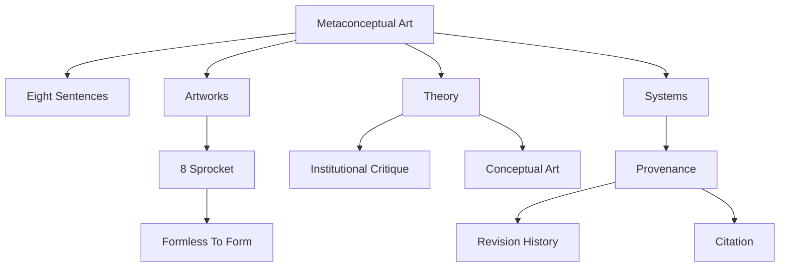

# MetaconceptualArt.com Roadmap

## Purpose

MetaconceptualArt.com should operate as both a website and a conceptual artwork: a public-facing proposition set, a museum-grade landing page, and the first layer of a future meta-museum. The project should communicate what Metaconceptual Art is, why it matters, how visitors should explore it, and how the site itself can become a living system of artworks, theory, provenance, and relations.

## North Star

Metaconceptual Art is art that treats art, its institutions, its markets, its archives, and its viewers as the material of the work.

The website should make that sentence visible, navigable, and provable.

## Current State

As of the current `main` branch, the project is a **Next.js 16 (App Router)
static-export site, deployed from GitHub via Vercel** — migrated from the
original hand-written static HTML. It is a small but fully working meta-museum:

- **Seven pages** — home, Artworks, Theory, Systems, Statement, About, Changelog —
  plus **per-work detail pages** at `/artworks/<slug>` and an interactive
  **`/explore`** knowledge-graph.
- **Evidence on view** — the Eight Sentences, a primary theory text, two
  catalogued works, a ten-node knowledge graph, a curatorial statement, a colophon.
- **Linked open data** — every work is a dereferenceable Linked Art (CIDOC-CRM)
  record with real content negotiation; concepts and figures are grounded in
  Wikidata + the Getty vocabularies; images carry IIIF manifests; a git-derived
  Activity Stream records change.
- **Living surfaces** — a daily "Today in the Graph" spotlight, a walkable graph
  explorer, deep-zoom artwork viewers, per-work social (OG) cards, and a dark
  "gallery" mode.
- **Verified** — CI runs the build, unit + route-smoke tests, Getty `cromulent`
  + JSON-LD validation, and Activity-Stream authenticity; a scheduled/on-demand
  probe checks the live Linked Art endpoint.

The remaining gaps are the participatory / Meta-Wiki features (Phase 5) and deeper
per-domain pages — extensions, not foundations.

## Roadmap Phases

### Phase 1: Clarify The Work

Goal: make the concept immediately legible without reducing its complexity.

Actions:

- Rewrite the hero around one canonical definition.
- Add a short proposition of 3 to 5 lines beneath the defining statement.
- Keep the Eight Sentences as the canonical sentence sequence, explicitly inspired by Sol LeWitt's "Sentences on Conceptual Art."
- Add plain-language glosses for each sentence to fulfill the promise of accessibility.
- Add a citation block so the work can be referenced formally.

Success criteria:

- A first-time visitor can explain the project in one sentence.
- An art-literate visitor can identify its relationship to conceptual art, institutional critique, systems art, and net art.
- The site clearly declares itself as the artwork, not just documentation of one.

### Phase 2: Resolve The Landing Page

Goal: make the first viewport feel intentional, museum-grade, and concept-first.

Actions:

- Redesign the hero as a full-viewport composition with a strong defining statement.
- Add a single visual anchor: either a treated artwork image, a conceptual diagram, or a generative/systemic artwork.
- Replace the current anchor navigation labels with the triad: Artworks, Theory, Systems.
- Ensure the next section is slightly visible on desktop and mobile.
- Use restrained motion: one choreographed entrance, subtle hover states, no parallax.

Success criteria:

- The first screen communicates title, definition, visual identity, and entry points.
- The page feels like an exhibition threshold rather than a generic portfolio page.
- The design is quiet, precise, and memorable.

### Phase 3: Publish Evidence

Goal: close the gap between proposition and artwork.

Actions:

- Publish 5 to 10 initial artworks.
- Publish one primary theoretical text.
- Create a versioned changelog.
- Add a colophon with tools, stack, decisions, collaborators, and conceptual framing.
- Treat the existing `images/8sprocket.jpg` as an artwork if it remains: title it, date it, describe it, and connect it to the system.

Success criteria:

- The project has works on view, not only claims.
- The theory section contains at least one citable primary text.
- The making of the site becomes visible as part of the work.

### Phase 4: Build The Meta-System

Goal: evolve the site from a landing page into a small knowledge graph.

Actions:

- Create a v1 graph with at least 10 nodes.
- Link artworks to concepts, sources, institutions, viewers, revisions, and provenance.
- Add structured data for artworks, defined terms, citations, and authorship.
- Create a visual diagram of the graph on the Systems page.
- Add stable identifiers for major concepts and artworks.

Success criteria:

- Every artwork has metadata, provenance, and conceptual relations.
- Visitors can move from artwork to concept to source.
- The semantic structure is visible in the interface and machine-readable in the code.

### Phase 5: Expand Into A Meta-Museum

Goal: turn the site into a living, evolving conceptual archive.

Actions:

- Add visitor responses, submissions, or interpretive logs.
- Add revision histories for key claims and the Eight Sentences.
- Create an AI-assisted Meta-Wiki for concepts, sources, and annotations.
- Add a public press release or curatorial statement.
- Consider registering or submitting the work to net art and contemporary art contexts such as Rhizome, e-flux, or Artsy.

Success criteria:

- The site changes over time in a visible, meaningful way.
- Visitors participate in the formation of meaning.
- The project becomes citable, expandable, and institutionally legible.

### Phase 6: Linked Open Data And Linked Art Conformance

Goal: make the museum legible to real collection-management systems by speaking
the art world's own linked-data standards, not only general-purpose ones.

Done:

- Grounded every concept, person, and movement node in a Wikidata QID and, for
  art-domain nodes, the Getty vocabularies (ULAN for people, AAT for concepts),
  with `equivalent` cross-walks between them.
- Published the works as CIDOC-CRM-correct **Linked Art (API 1.0)** records under
  `/data/linked-art/`: digital objects (the website, the image), a textual work
  (the Eight Sentences), a collection `Set`, a `Group` (Sun & Rain Works), a
  `Concept`, and a `ProvenanceActivity`.
- Classified names (primary name), identifiers (accession number), and statements
  (description) with their AAT terms; used the correct creation events
  (`created_by`/`Creation`) and depiction (`digitally_shows`).
- Added the non-semantic HAL `_links` block (self, version links, collection) to
  every record and an `.htaccess` that serves them as
  `application/ld+json;profile="…linked-art.json"` with CORS.
- Declared rights as a CC-BY 4.0 `Right` (`subject_to`) on each work, and a
  `RightAcquisition` in the provenance activity that `establishes` it.
- Published an IIIF Activity-Streams discovery collection (`OrderedCollection` +
  `OrderedCollectionPage`) listing a `Create` for every record, linked from the
  collection's HAL block, so the set is crawlable.
- Certified the records against the **Getty `cromulent` reference library** (the
  authoritative Linked Art implementation) and a `pyld` JSON-LD expansion, both
  folded into the verify gate. This caught a real CRM error — custody cannot be
  transferred for digital/textual works — which was corrected.
- Wired the verify gate into **CI** (GitHub Actions): every push and pull request
  re-runs cromulent + JSON-LD certification, so conformance can never silently
  regress.
- Met the protocol's **minimal static-file conformance**: `vercel.json` serves
  `application/ld+json` with the profile, answers `GET` and `OPTIONS`, and sets
  permissive CORS in production; the legacy `.htaccess` equivalent is retained
  for Apache-style static hosting.
- Went past the minimum to **full API 1.0 dereferencing**: every record now has a
  single **extensionless canonical URI** (e.g. `…/data/linked-art/site-as-artwork`)
  served with **real content negotiation** — `Accept: text/html` 303-redirects to
  the human page where one exists, `Accept: application/ld+json` returns the
  profiled JSON-LD, and the legacy `.json` URL 301s to the canonical URI so each
  resource has exactly one identifier (`vercel.json` in production, with
  `data/linked-art/.htaccess` retained as the Apache equivalent).
- Made the discovery stream **genuinely event-driven**: `build_activity_stream.py`
  derives a `Create`/`Update` activity for every record from its real git-commit
  history (actual author dates), paginated as `OrderedCollection` +
  `OrderedCollectionPage`. A `--check` mode verifies authenticity (no fabricated
  timestamps) and Create-completeness in CI.
- Added a **live-endpoint conformance probe** (`verify_live.py`) that asserts the
  served behaviour (status, profiled media type, CORS, `Vary`, negotiation,
  canonical 301, OPTIONS). The per-push workflow verifies the static export and
  Linked Art records offline; `.github/workflows/conformance.yml` probes
  **production** weekly and on demand.

Next (genuinely optional enrichment, not conformance):

- Stand up standalone `Person` records where ULAN coverage is thin, and more
  `Concept` records for the remaining defined terms.
- Add richer provenance: exhibition (`Activity`) and acquisition events.
- Add `Delete` activities to the discovery stream if records are ever retired.

Success criteria:

- Each record dereferences to a valid Linked Art document at a stable URI. (met)
- An external aggregator (e.g. a LUX-style index) could ingest the collection
  without bespoke mapping. (met for the current record set)
- The records pass the Getty reference implementation. (met — 7/7 in CI)

### Phase 7: Platform — Next.js + Vercel

Goal: make the site easy to work with and deploy without losing what makes it the
work (the static, checkable, standards-first artifact).

Done:

- Migrated the hand-written static HTML to **Next.js 16 (App Router) with static
  export** (`output: 'export'`); shared `SiteHeader`/`SiteFooter`/`JsonLd`
  components; the Systems live-Wikidata query became a client component.
- Deploy from GitHub via **Vercel** (push-to-deploy, preview deploys per PR),
  replacing the manual FileZilla → HostGator upload.
- Re-homed the Linked Art content negotiation from Apache `.htaccess` to
  `vercel.json`; kept `images/` and `data/` canonical at the repo root, mirrored
  into `public/` at build by `scripts/prepublic.mjs`.

Success criteria: editing is component-based; every push deploys; the live Linked
Art conformance survived the move (verified by `verify_live.py` against production). (met)

### Phase 8: Interactive & Interoperable Museum

Goal: turn the static records into living, explorable, interoperable surfaces —
adapting the strongest ideas from two reference apps (a Wikidata explorer and the
"Artwork of the Day" daily art-history engine) to this project's static stack.

Done:

- **`/explore`** — an interactive ego-graph of the knowledge graph: pick a node,
  follow typed relations to re-centre, with authority links and a live Wikidata
  "related by influence" query. Deep-linkable (`/explore?node=<id>`).
- **"Today in the Graph"** — a daily, deterministic spotlight (stable per UTC day,
  "Surprise me") with a cited "From Wikidata" facts block — grounded, never
  generated.
- **IIIF** — a Presentation 3.0 manifest per image work + an OpenSeadragon
  deep-zoom viewer (so works speak both Linked Art *and* IIIF).
- **Per-work detail pages** (`/artworks/<slug>`) from a single `lib/works.ts`
  source of truth, each with a **build-time branded OG share card** (`next/og`).
- **Dark "gallery" mode** — a persisted, no-flash theme toggle.

Success criteria: a visitor can wander the graph and the collection; each work has
its own URL, social preview, and dual-standard records. (met)

### Phase 9: Quality, SEO & Resilience

Goal: make the rigor visible and the site robust and discoverable.

Done:

- **Per-work `schema.org`** (VisualArtwork/CreativeWork) structured data.
- **Official Linked Art JSON Schemas** vendored and run as an *advisory* second
  opinion alongside the gating Getty `cromulent` check; all schema-covered
  top-level records now validate cleanly.
- A **`node --test` suite** — works/graph integrity, Linked Art id↔file
  consistency, and route + asset smoke over the export — wired into `npm test`, CI,
  and the ship gate.
- **SEO/resilience** — `sitemap.xml`, `robots.txt`, a branded 404, and a React
  error boundary around the interactive islands.

Success criteria: the build is gated by tests + validation; the site is crawlable
and degrades gracefully. (met)

### Phase 10: Proof Of Movement

Goal: make the claim that Metaconceptual Art is a natural, credible, and valid
movement inspectable through linked open data rather than asserted only in prose.

Started:

- Added `/movement`, a public **Movement Record** that organizes the argument
  around genealogy, defined principles, works on view, machine-readable
  legitimacy, external alignment, and provenance over time.
- Added `concept:metaconceptual-art` as a first-class graph node, linked to the
  existing local Linked Art `Type` record and outward to established concepts.
- Added Semantic Web (`Q54837` / AAT `300391330`) and linked open data
  (`Q18692990`) as standards/practice anchors in `data/graph.json`.
- Enriched the Linked Art `concept-metaconceptual-art` record with the Concept
  model's creation-influences pattern: `created_by` / `Creation` /
  `influenced_by`, connecting the local movement concept to conceptual art,
  institutional critique, systems art, internet art, provenance, Semantic Web,
  and linked open data.
- Added the Record to navigation, sitemap, route-smoke tests, and the visible
  Systems register.
- Added `/llms.txt` as a bot-facing index for agents and crawlers.
- Added `/data/profile/metaconceptual-art-profile.jsonld`, a project-level
  linked-open-art profile defining minimum evidence for a valid Metaconceptual
  Art claim.
- Added `/data/profile/metaconceptual-art-claim.schema.json`, a lightweight
  JSON Schema validation shape for future works or claims.
- Added `movement-record` as a citable Linked Art `LinguisticObject` record,
  with content negotiation to `/movement`, collection membership, and route smoke
  coverage.

Next:

- Add independent bibliography / external reception once third-party sources
  exist, keeping that separate from self-authored evidence.
- Add fuller `Person` and `Concept` records for thin-coverage lineage nodes.

Success criteria:

- A visitor can understand the movement claim without specialized standards
  knowledge.
- A machine can follow the claim through stable URLs, graph nodes, Linked Art
  records, and authority links.
- The project remains honest about the boundary between internal validity and
  external canonization.

### Phase 11: Reference Standard

Goal: move from "this site publishes Linked Art" to "this site defines a
reusable linked-open-art profile for Metaconceptual Art claims."

Done:

- Published `/profile/1.0/` as the human-readable Metaconceptual Art Linked Open
  Art application profile with four conformance levels: Minimal, Citable,
  Museum-grade, and Interoperable.
- Added a versioned JSON-LD context and profile metadata under
  `data/profile/1.0/`.
- Added `data/profile/metaconceptual-art-claim.shacl.ttl`, giving the profile an
  RDF graph shape in addition to the existing JSON Schema.
- Added passing and failing fixtures plus a starter template under
  `data/profile/examples/` and `data/profile/templates/`.
- Added `scripts/validate-claim.mjs` and `npm run validate:claim`, which checks
  the current claim or a supplied local/remote claim against the JSON Schema and
  SHACL-derived evidence rules.
- Added `/validate`, a browser-facing validator for pasting or editing claim
  JSON.
- Added dataset-level descriptors: `data/void.ttl`, `data/dcat.jsonld`,
  `/.well-known/void`, and `data/releases/1.0/checksums.json`.
- Added a publication-status vocabulary and portfolio staging policy for private,
  forthcoming, metadata-only, and public records, so the standards surface can be
  public before the full portfolio is published.
- Corrected the origin chronology in the public Record and Linked Art records:
  Sun & Rain Works formation is modeled as 2005, Metaconceptual Art movement
  creation as 2007, `www.wtfisart.com` as a website built around 2009 in
  connection with the studio's Sotheby's Photographs auction engagement (sale
  N08533), and 2026 as the public linked-data publication layer.
- Exposed the profile, validator, descriptors, and fixtures through the sitemap,
  bot index, export smoke tests, and production content-type headers.

Next:

- Promote additional portfolio works from private/forthcoming to metadata-only or
  public Linked Art records when their catalog facts and media are ready.
- Expand the reference dataset from the current canonical corpus toward 10 to 20
  public works and 10 to 20 concept/person/activity examples.
- Add a stricter SHACL runner if the static build later adopts an RDF validation
  dependency.
- Share the technical modeling note with Linked Art / IIIF / digital humanities
  communities once the public corpus is stable.

### Phase 12: External Legibility Pass

Done:

- Expanded the public artwork corpus to six works by adding `www.wtfisart.com`,
  `Art Market Reform`, `Eightfold Sprocket`, and `Movement Graph` to
  `lib/works.ts`, per-work pages, the local graph, the collection Set, and
  Linked Art records.
- Added `/modeling`, a technical note explaining why the website is modeled as a
  `DigitalObject`, why the movement is a local `Type`, and why origin provenance
  is separated from publication metadata.
- Added `/bibliography`, a standards/lineage/reception page that clearly
  separates external references from independent reception.
- Added `data/metaconceptual-art.ttl`, a compact RDF/Turtle dump, and exposed it
  through VoID, DCAT, `/llms.txt`, Vercel content-type headers, and smoke tests.
- Added a homepage works constellation so the first visit shows a public corpus
  rather than only a manifesto.

Next:

- Add genuinely independent reception when it exists.
- Continue expanding the corpus toward 10 to 20 public works.

### What's next

Recently completed (post-v0.8 polish): verified the responsive layout (no
horizontal overflow anywhere), trimmed ~2.9 MB of unused images, added a web-app
manifest + skip-to-content link, and DRY'd the three client islands onto a shared
`lib/wikidata.ts`.

Forward-looking, in rough priority — none are foundational, and each now needs
input beyond engineering:

- Deeper **`/theory/<slug>`** essays (needs written content) and standalone
  `Person`/`Concept` records where coverage is thin.
- Promote portfolio works into the public profile dataset deliberately: private
  first, then metadata-only or public Linked Art records when ready.
- Phase 5 participation: visitor responses / interpretive logs, revision histories
  for claims — requires a backend/form service (the site is a static export).
- Submit/register the work in net-art contexts (Rhizome, e-flux) — an external
  action.
- Optional: page-weight/load-time budgets in CI (e.g. Lighthouse CI).

## Information Architecture

Current structure (✅ live, 🔭 planned):

```text
/                       Landing page (hero, Today spotlight, sentences, triad)
/artworks               ✅ Works on view
/artworks/<slug>        ✅ Per-work detail pages (+ build-time OG card)
/theory                 ✅ Reading room (primary text)
/theory/<slug>          🔭 Essays, propositions, annotations
/systems                ✅ Knowledge graph + node register
/explore                ✅ Interactive graph explorer
/movement               ✅ Movement Record
/modeling               ✅ Technical modeling note
/bibliography           ✅ External sources and reception boundary
/profile/1.0            ✅ Linked Open Art Profile v1.0
/validate               ✅ Profile validator
/statement              ✅ Curatorial statement
/about                  ✅ Colophon, provenance, citation
/changelog              ✅ Version history of the work
/data/linked-art/<id>   ✅ Linked Art (CIDOC-CRM) records, content-negotiated
/data/iiif/<id>/...     ✅ IIIF Presentation 3.0 manifests
/sitemap.xml /robots.txt ✅ SEO
```

Landing page triad:

- Artworks: works, gestures, diagrams, prompts, images, and happenings.
- Theory: definitions, propositions, essays, citations, and glosses.
- Systems: knowledge graph, provenance, metadata, and the Meta-Wiki.

## Landing Page Wireframe

```text
------------------------------------------------------------
Metaconceptual Art                         Artworks Theory Systems
------------------------------------------------------------

Metaconceptual Art
Art that treats art, its institutions, markets, archives,
and viewers as the material of the work.

[Visual anchor: artwork, diagram, or generative system]

Artworks        Theory        Systems

------------------------------------------------------------
The Sentence Sequence
Eight Sentences On Metaconceptual Art

01  A returning of the Formless to Form (Art).
    Plain-language gloss or annotation.

02  An examination of the commodification of Art...
    Plain-language gloss or annotation.

...

------------------------------------------------------------
On View
Initial artworks with metadata and relations

------------------------------------------------------------
Semantic Layer
Artwork -> Concept -> Source -> Institution -> Viewer

------------------------------------------------------------
Citation / Version / Colophon
```

## Conceptual Copy

### Hero Definition

Metaconceptual Art is art that studies art as a system: artwork, institution, market, archive, viewer, and meaning folded into one living form.

### Short Proposition

The artwork is not only the object.
It is the condition that permits the object to be seen.
It is the institution that frames it, the market that prices it, the archive that remembers it, and the viewer who activates it.
Metaconceptual Art makes that hidden system visible.

### Plain-Language Framing

This website is not only a place to display Metaconceptual Art. It is part of the artwork. Its pages, metadata, revisions, links, and absences are treated as material.

### Triad Copy

Artworks:
Works, gestures, images, prompts, diagrams, and events placed on view as evidence of the concept in motion.

Theory:
A reading room for definitions, propositions, annotations, sources, and primary texts.

Systems:
A future Meta-Wiki where artworks, concepts, citations, revisions, and viewers become a linked field.

### Footer Citation Block

Recommended citation:

```text
Sun & Rain Works. Metaconceptual Art. 2026.
Website as conceptual artwork.
https://www.metaconceptualart.com
Accessed [date].
```

## Visual Identity Direction

Principles:

- Minimal, museum-grade, and typographically confident.
- Use one strong visual anchor instead of many decorative elements.
- Favor art-book restraint over web-app density.
- Treat metadata, dates, and provenance as visual material.

Palette (as shipped in `app/globals.css` — a warm paper ground with an
orange/blue/green/yellow accent set; a dark "gallery" variant under
`html[data-theme="dark"]`):

```css
:root {
  --ink: #151515;     /* text */
  --paper: #fffdf5;   /* page ground */
  --deep: #11437e;    /* headings */
  --navy: #08203f;    /* footer */
  --accent: #e8590c;  /* orange */
  --blue: #1971c2;
  --green: #2f9e44;
  --gold: #f7b500;
}
```

Typography direction:

- Display serif for title and sentence sequence.
- Precise sans serif for navigation and UI.
- Monospace for metadata, provenance, citations, and graph labels.

Image direction:

- If `8sprocket.jpg` remains, make it a titled work with metadata.
- If it is replaced, use a diagrammatic or generative artwork that embodies recursion, relation, and institutional structure.
- Avoid purely atmospheric imagery.

## Semantic Model

Core node types:

- Artwork
- Concept
- Source
- Institution
- Viewer
- Revision
- Exhibition
- Claim
- Term
- Author

Core relations:

```text
Artwork expresses Concept
Artwork cites Source
Concept derives_from Source
Institution frames Artwork
Viewer activates Meaning
Revision modifies Claim
Claim belongs_to PropositionSet
Term defines Concept
Exhibition presents Artwork
Author creates Artwork
```

Minimum viable graph:



## Technical Roadmap

Done:

- **Next.js 16 App Router, static export**, deployed from GitHub via Vercel (no
  more manual upload). _(superseded the old "consider a static site generator"
  note — we now are one.)_
- Page sections/routes for Artworks, Theory, Systems, Explore, Statement, About,
  Changelog, and per-work detail pages generated from `lib/works.ts` metadata.
- JSON-LD per page (site graph) and per work (`schema.org`); a visible graph
  diagram (Systems) and an interactive explorer.
- Repeated data moved into structured files (`data/graph.json`,
  `data/linked-art/`, `lib/works.ts`); event-driven changelog data.
- CI gate: build + `node --test` + Linked Art validation + live conformance probe.
- Verified responsive layout (no overflow); trimmed ~2.9 MB of unused images.
- Web-app manifest + skip-to-content link; DRY'd the client islands onto a shared
  `lib/wikidata.ts` SPARQL helper.

Later:

- `/theory/<slug>` essays and a searchable Meta-Wiki.
- Visitor annotations / submissions; provenance trails per claim (needs a backend).
- Performance budgets in CI (e.g. Lighthouse CI).

## Portfolio Positioning

The project should present itself as:

- A conceptual artwork.
- A design system.
- A semantic web experiment.
- A contemporary art theory project.
- A portfolio piece demonstrating typography, accessibility, structured data, performance, and information architecture.

Suggested process page sections:

- Why this exists.
- What Metaconceptual Art means.
- How the visual system was designed.
- How the semantic layer works.
- What changed across versions.
- What comes next.

## Implementation Checklist

### Immediate Wins

- [x] Add canonical definition to hero.
- [x] Add short proposition below hero.
- [x] Rename navigation to Artworks, Theory, Systems.
- [x] Add visual anchor treatment or replace current image.
- [x] Add citation block to footer or About section.
- [x] Add plain-language glosses to the Eight Sentences.
- [x] Add a visible graph diagram.

### Content

- [x] Publish initial catalogued works.
- [x] Expand the collection to 5 to 10 artworks.
- [x] Publish one primary essay.
- [x] Write a press release or curatorial statement.
- [x] Add a colophon.
- [x] Add influences and citations.

### System

- [x] Add `/artworks`.
- [x] Add `/theory`.
- [x] Add `/systems`.
- [x] Add `/about`.
- [x] Add `/changelog`.
- [x] Create 10-node knowledge graph.
- [x] Add per-node metadata and stable IDs.

### Design

- [x] Refine palette toward art-book warmth.
- [x] Improve type scale and hierarchy.
- [x] Add metadata/provenance styling.
- [x] Reduce decorative noise.
- [x] Add one restrained entrance animation.

### Accessibility And Performance

- [x] Ensure all headings are ordered.
- [x] Add alt text for meaningful images.
- [x] Preserve keyboard navigation.
- [x] Respect `prefers-reduced-motion`.
- [x] Keep JavaScript minimal.
- [x] Add a dark "gallery" mode (persisted, no-flash).
- [x] Add a skip-to-content link and a web-app manifest.
- [x] Verify mobile layout (no horizontal overflow).
- [x] Trim page weight (removed ~2.9 MB of unused images).
- [ ] Add page-weight/load-time budgets in CI.

### Platform & interoperability

- [x] Migrate to Next.js 16 static export; deploy from GitHub via Vercel.
- [x] Linked Art records with extensionless URIs + content negotiation (vercel.json).
- [x] Event-driven Activity Stream from git history.
- [x] IIIF manifests + deep-zoom viewer.
- [x] Per-work detail pages (`/artworks/<slug>`) + build-time OG cards.
- [x] Interactive graph explorer (`/explore`) + daily "Today" spotlight.
- [x] Shared `lib/wikidata.ts` SPARQL helper across the client islands.

### Quality, SEO & resilience

- [x] `node --test` suite (integrity + route smoke) in CI and the ship gate.
- [x] Getty `cromulent` + JSON-LD validation; advisory official LA JSON Schemas
      clean for schema-covered records.
- [x] Live-endpoint conformance probe (CI + scheduled production).
- [x] Per-work `schema.org`; sitemap.xml + robots.txt; branded 404; error boundary.

## Priority Order

The original build sequence (hero → landing → evidence → citation/changelog →
graph → real pages → participation) is **complete through Phase 9**, except for
Phase 5 participation and deeper content expansion. Current priority order:

1. Add fuller `Person` and `Concept` records for thin-coverage lineage nodes.
2. `/theory/<slug>` essays.
3. Continue expanding the collection from 6 catalogued works toward 10 to 20
   works, with each new work conforming to the Metaconceptual Art profile.
4. Phase 5 participation (visitor responses, revision histories).
5. Submit/register the work in net-art contexts.
6. Optional SHACL validation and CI performance budgets.

## Working Principle

A proposition without evidence remains a claim. A proposition with artworks, provenance, revisions, and relations becomes a system. For MetaconceptualArt.com, the system is the work.
